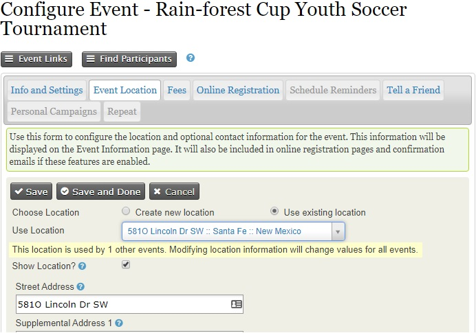

# Creació d'esdeveniments

Aquest capítol tracta sobre com crear un esdeveniment nou, descrivint cada una de les
opcions de configuració disponibles en la pantalla de creació de l'esdeveniment. Si voleu
permetre les inscripcions en línia a l'esdeveniment, voldreu llegir també el
capítol *Inscripcions en línia d'esdeveniments*. Si no, voldreu llegir el
capítol *Inscripcions manuals d'esdeveniments*.

Per començar, creeu un esdeveniment nou escollint **Esdeveniments > Esdeveniment nou**
en el menú. (Si no podeu veure el menú d'esdeveniment, assegureu-vos que
heu habilitat el component d'esdeveniment. Ho podeu fer a **Administra >
Configura > Configuracions globals > Habilita els components**.)

## Informació i configuracions de l'esdeveniment

La primera pàgina que veieu quan creeu un esdeveniment us demana informació bàsica
sobre l'esdeveniment. Podeu clicar en qualsevol dels signes d'interrogació blaus per
mostrar l'ajuda per a cada un dels camps. Quan veieu un llapis, si hi cliqueu
us portarà a una pantalla on podreu editar les opcions disponibles.
Noteu, que depenent dels permisos que tingueu, es possible que no pugueu editar aquestes
opcions i per tant no veureu el llapis.

**Plantilla base** us permet crear un esdeveniment des d'una plantilla (vegeu
el capítol *Plantilles d'esdeveniments* en aquesta secció) en comptes de crear-ne un des de
zero.

**Tipus d'esdeveniment** us permet categoritzar l'esdeveniment.

Si teniu habilitat **CiviCampaign**, podreu seleccionar una campanya per aquest
perquè passi a ser part d'ella (vegeu la secció *Campanyes* per més detalls).

**Rols** distingeix diferents tipus de participants d'esdeveniments, com ara
assistents, conferenciants i treballadors. Quin rol s'hauria d'assignar als participants
quan s'inscriuen en línia per aquest esdeveniment? El valor col·locat en aquest camp
s'assignarà per defecte quan els usuaris es registrin en línia o quan
importeu inscripcions sense incloure el camp rol del participant amb
altres valors en el fitxer d'importació CSV. El valor més comú és assistent.

Voleu que els usuaris vegin un llistat dels participants i quanta
informació sobre els participants voleu revelar? Els **Llistats de
participants** demostren el suport per un esdeveniment i poden ajudar a generar
interès dins la vostra comunitat de constituents. Noteu que les opcions que
definiu en aquesta secció només *habiliten* els llistats de participants &mdash; per mostrar-ne
un, haureu de crear un element de menú o enllaçar aquest llistat
en algun lloc del web. Un cop hagueu creat l'esdeveniment,
l'enllaç al llistat de participants es mostra a la pàgina de configuració de l'esdeveniment.
Consulteu el capítol *Gestió d'esdeveniments* per informació de llistats de
participants i altres maneres de promocionar els esdeveniments.

Com es diu l'esdeveniment? El **Títol de l'esdeveniment** apareixerà a les pàgines
d'informació de l'esdeveniment, pàgines d'inscripció, llistats d'esdeveniments i en la pàgina
d'administració de gestió d'esdeveniments. Assegureu-vos d'escollir un títol significatiu,
ben elaborat que representi l'esdeveniment.

Els següents dos camps (**Resum d'esdeveniment** i **Descripció completa**) us deixen
descriure l'esdeveniment. Ambdues, tant el resum com la descripció completa
s'inclouran en les pàgines d'informació de l'esdeveniment. Utilitzeu l'editor de text enriquit
proporcionat pel camp de descripció per incloure fotos, imatges i
text formatat.

Introduïu la **Data/hora d'inici** i la **Data/hora de finalització** per l'esdeveniment.
Aquestes s'inclouran en la pàgina d'informació de l'esdeveniment i en els llistats de l'esdeveniment.

Podeu configurar un **Nombre màxim de participants** per cada esdeveniment i
definir un missatge a ser mostrat quan aquest número sigui assolit.

Si voleu mostra un mapa ensenyant la ubicació de l'esdeveniment podeu fer-ho
utilitzant qualsevol dels dos Google Maps o Open Street Maps (necessitareu configurar
el servei de mapes a través de **Administra > Opcions del sistema > Mapes
i geolocalització**).

Seleccioneu la casella d'**Esdeveniment públic** per incloure l'esdeveniment en llistats promocionals
com canals RSS, fitxers o canals iCal, o pàgines de llistats
d'esdeveniments.

Seleccioneu **Permet compartir a través dels mitjans socials** per incloure els enllaços a
mitjans socials per compartir aquest esdeveniment en la pàgina d'informació de l'esdeveniment, en la pàgina d'agraïemnt,
en la pàgina explica-ho a un amic (si està habilitada) i en els correus electròncis de confirmació de l'esdeveniment.

Per acabar, teniu l'opció de fer aquest esdeveniment actiu o inactiu. Si
preveieu que us portarà un temps completar la configuració
de l'esdeveniment, considereu fer-lo inactiu fins que estigui completat per
assegurar-vos que no es llista de manera imprevista en el canal de llistats d'esdeveniments.
Podeu activar fàcilment l'esdeveniment quan estigueu apunt per començar a
publicitar-lo.

Després de revisar els detalls d'aquesta pàgina, cliqueu, **Continua >>** per
crear l'esdeveniment i avançar al següent pas. Podeu interrompre
la configuració en qualsevol pàgina posterior clicant **Desa i acaba** i
tornar més tard per revisar i modificar qualsevol de les configuracions.

Per tornar a un esdeveniment desat, navegueu a **Esdeveniments > Gestió d'esdeveniments** i
cliqueu **Configura** per continuar treballant en l'esdeveniment.

## Localització de l'esdeveniment

El següent pas és completar la localització i els detalls de contacte per
l'esdeveniment.

Un cop hagueu introduït una localització per l'esdeveniment podeu reutilitzar-la per a esdeveniments
posteriors clicant **Utilitza una ubicació existent** i seleccionant-la de la
llista desplegable. Noteu que si seleccioneu una ubicació existent i l'editeu,
s'actualitzarà aquesta ubicació per a tots els esdeveniment que l'utilitzin.

Podeu llistar també números de telèfon i adreces de correu electrònic en la pàgina
d'informació de l'esdeveniment si voleu donar als inscrits una manera per contactar directament amb
els organitzadors. Si l'esdeveniment es realitza fora de l'ubicació principal
de l'organització, podríeu voler proporcionar la informació del contacte
de la localització de la trobada.

## Tarifes

Si l'esdeveniment és gratuït, marqueu el botó d'opció **Esdeveniment amb pagament** com a **No**,
després cliqueu a **Desa** i salteu a inscripció en línia.

Si es tracta d'un esdeveniment amb pagament, cliqueu **Si**. La pantalla us mostrarà les opcions
disponibles (vegeu el següent conjunt de captures de pantalla).

Quin **Tipus de contribució** (tipus financer) s'assignarà a les inscripcions amb pagament
per aquest esdeveniment? Encara que el valor més comú per aquest
camp és senzillament tarifa d'esdeveniments, CiviCRM proporciona la flexibilitat per definir
múltiples tipus de finançament i assignar-los a diferents esdeveniments segons convingui.
Vegeu *Configuració* en la secció de **Contribucions** pels detalls.

Si teniu previst acceptar pagaments amb targeta de crèdit a través del formulari
d'inscripció en línia necessiteu configurar un **processador de pagament** abans
de crear l'esdeveniment. Per trobar més informació sobre aquest tema vegeu *Processadors
de pagament* en la secció de *Contribucions*.

Voleu permetre als inscrits pagar més tard enviant un xec postal,
pagar al moment en efectiu o amb targeta de crèdit o habilitar qualsevol altre mètode de
pagament? Si és així, podeu activar l'**opció de pagament en diferit** i definir una
etiqueta i unes instruccions de pagament. Si el manteniu desmarcat, es requerirà
fer el pagament als inscrit mitjançant targeta de crèdit.

Les **tarifes regulars** proporcionen un conjunt de nivells de preus dels quals l'inscrit
ha de seleccionar un únic nivell (p. ex. una inscripció individual per 50€ o
una inscripció familiar per 100€). Cada import de tarifa té una etiqueta assignada
i podeu configurar una tarifa per defecte. Aquesta aproximació funciona bé per la majoria d'esdeveniment
i és senzill de configurar. Aquí un exemple simple:

Si l'esdeveniment requereix una estructura de preus més complexa, amb més
opcions o extensions addicionals, potser voleu utilitzar **conjunts de preus** o
**descomptes**. Per més informació sobre aquest tema, vegeu el capítol *Tarifes
d'esdeveniment complexes* en aquesta secció.

## Inscripcions en línia

Permetre a la gent inscriure's en línia (pel seu compte) a través del lloc web
ofereix molts beneficis. La inscripció en línia és convenient pels vostres
contactes i poden estalviar al vostre equip temps i recursos. Si no necessiteu
oferir la inscripció en línia, no marqueu **Permetre la inscripció
en línia** i passeu al següent pas. Si voleu permetre
la inscripció en línia, vegeu el capítol *Inscripció d'esdeveniments en línia*
en aquesta secció.

## Recordatoris programats

Els recordatoris programats es poden utilitzar per enviar automàticament correus electrònics als inscrits
als esdeveniments en certs moments abans o després dels esdeveniments, per exemple

-   una setmana abans: recordar que haurien de consultar l'hora de la
    conferència
-   un dia després: demanar que emplenin un formulari d'avaluació
-   dos dies abans que un pagament venci per a les inscripcions pendents d'un pagament
    diferit: advertir que la seva inscripció es cancel·larà si no proporcionen
    els detalls de pagament en les properes 48 hores.

Per configurar un recordatori programat per un esdeveniment específic, cliqueu en la
pestanya de recordatoris programats que us mostrarà els recordatoris programats existents
per aquest esdeveniment (si n'hi ha cap) i cliqueu a **Afegeix recordatori**.

Empleneu en els detalls d'aquest
formulari per enviar, per exemple, un correu electrònic a tots els conferenciants inscrits 3
dies abans de la data d'inici de l'esdeveniment. Noteu que podeu limitar els destinataris per
l'estat (inscrit, assistit, etc.) i també per rol (conferenciant, assistent,
voluntari, etc.). Podeu també utilitzar una plantilla o compondre el vostre propi
missatge en la caixa de format HTML.

A més de configurar recordatoris en un esdeveniment, també podeu
configurar-los per un tipus específic d'esdeveniments i afegir-los a plantilles d'esdeveniments
específiques. La idea és bàsicament la mateixa que la de dalt però podeu accedir
a aquesta funcionalitat des de **Administra > Comunicacions > Recordatoris
programats**.

## Explica-ho a un amic

CiviEvent fa que sigui més fàcil aprofitar el poder de les xarxes socials dels vostres contactes
compromesos permetent-los compartir d'una manera ràpida i fàcil detalls
sobre la vostra organització i de l'esdeveniment amb els vostres amics i col·legues. El
pas final en la creació de l'esdeveniment és una pàgina on podeu habilitar les
capacitats d'"Explica-ho a un amic". Podeu definir el text i els enllaços que han de ser
inclosos en aquesta pàgina i en el correu electrònic enviat des de l'eina (vegeu la
següent captura de pantalla).

Un registre d'activitat "Explica-ho a un amic" s'afegirà a la pestanya d'activitat
del participant cada vegada que enviï un correu electrònic als seus amics. Això us permet
fer un seguiment els vostres seguidors més actius i comprometer-los més. La gent
que rep els correus electrònic utilitzant aquesta funcionalitat també seran automàticament afegits a
CiviCRM com a contactes.

## Confirmacions i rebuts d'inscripcions

Podeu enviar confirmacions i rebuts automàtics per correu electrònic als participants
que s'inscriuen en un esdeveniment, si s'inscriuen en línia o si han estat inscrits
pel vostre equip o voluntaris. El contingut i la disposició d'aquests correus elctrònics
es controlen per plantilles de missatges. Es proporcionen tant formats HTML com de text.
Podeu modificar o afegir text en aquests correus electrònics, o afegir-hi la imatge corporativa
com un logotip a les versions HTML. Per configurar l'adreça de correu electrònic del remitent des d'on
les confirmacions i les receptes, vegeu Configuració en la secció de Correu
electrònic.

Navegueu a **Administra > Comunicacions > Plantilles de missatges** (mostrat
en la captura de pantalla de continuació) i cliqueu la pestanya **Missatges de flux de treball del sistema**
per veure la llista de missatges que podeu modificar. Cliqueu **Edita** al costat de
la fila "Esdeveniments - Inscripció confirmació i rebut" per editar
el contingut i la disposició.

Les plantilles per aquests missatges inclouen tant el text a mostrar com
també la lògica de programació necessària. Aneu amb compte quan editeu de no modificar
la lògica del programa. Assegureu-vos de provar el flux i revisar els correus electrònics
enviats després d'efectuar qualsevol canvi. Si trobeu que els vostres canvis han causat
problemes, errors o la pèrdua d'informació, sempre podeu revertir el flux a la
configuració per defecte del sistema.  
