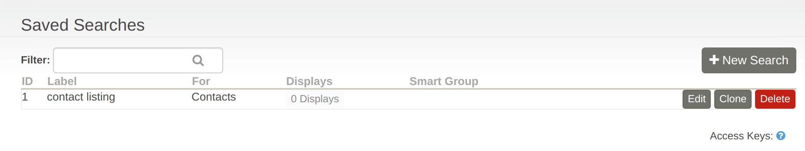
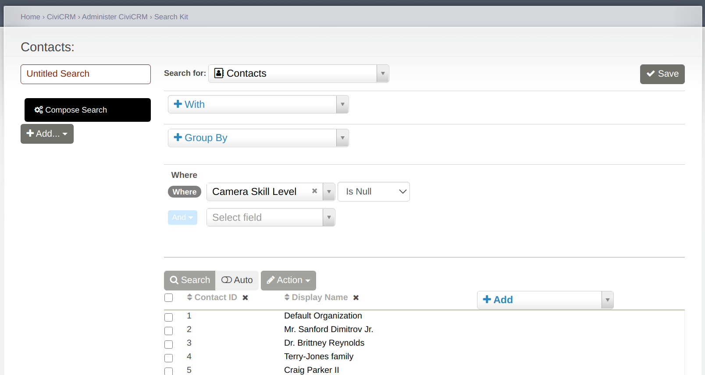
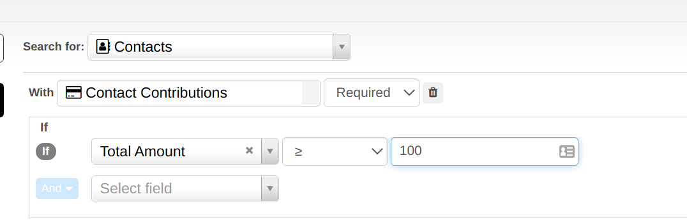
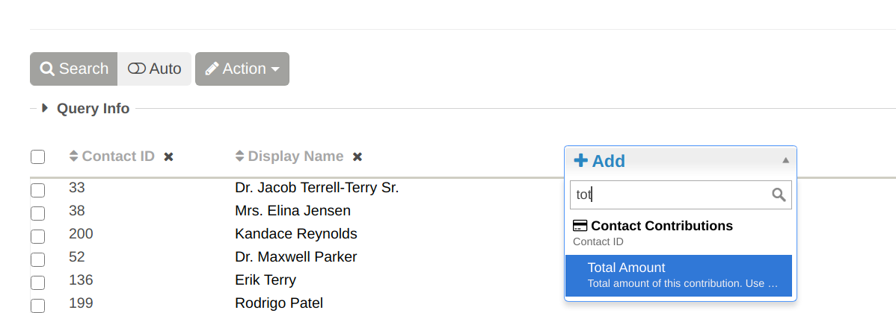
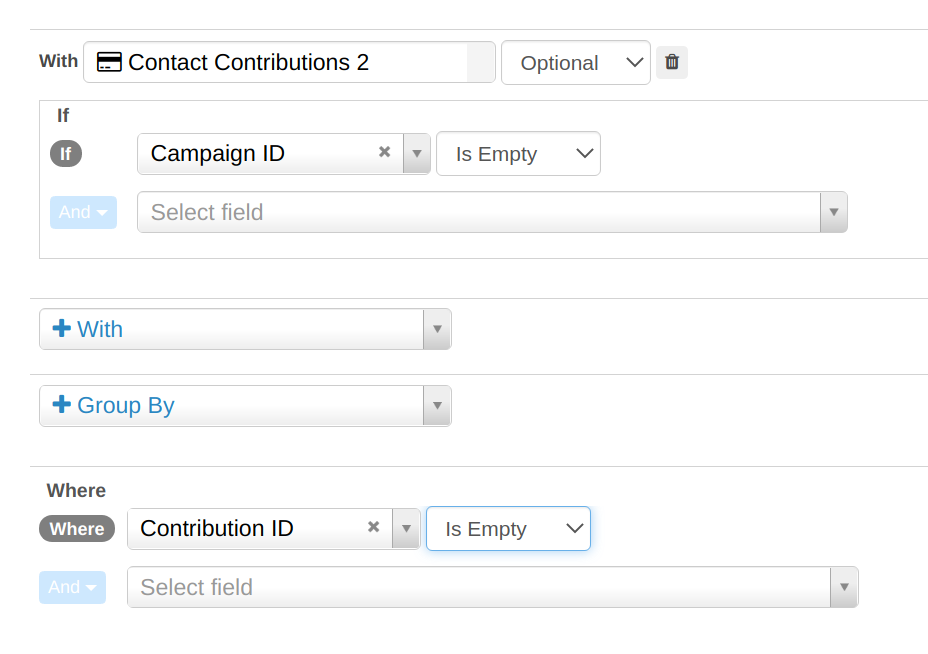
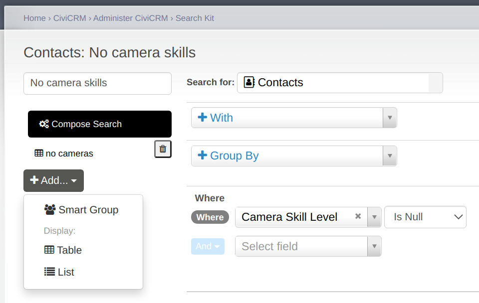
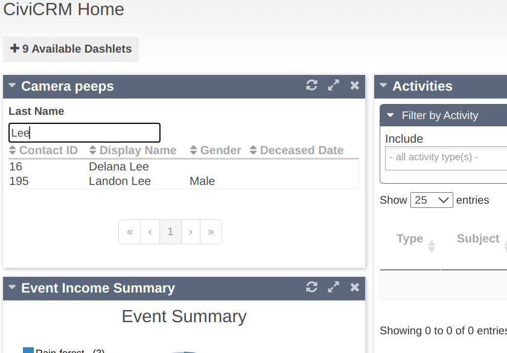
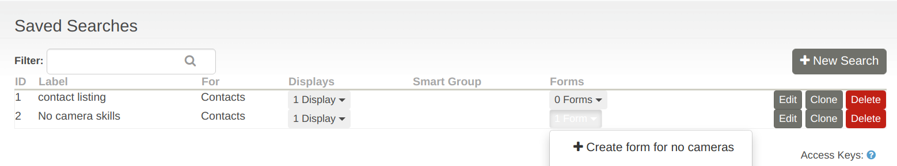

# Search kit

Search kit is a new search interface which as of writing (5.36) is
in beta mode. It ships as an extension when you can enable on 
the extensions screen in releases from 5.29 onwards. However it has
developed rapidly and we strongly recommend that if you are exploring
it you do so on the latest version of CiviCRM. The functionality
that is in this section is based on CiviCRM 5.36 and may not
be present in earlier versions. It may also change visually.

!!! note 
Search kit ships as an extension as part of our strategy of
putting significant functionality leaps into extensions rather than 
overhauling existing code. This allows us to demarcate rapidly evolving
code and to keep long-standing code more stable. People can opt into 
the extension or not. However it is maintained as part of core against
the specific release it ships with (as it is closely tied to apiv4 
functionality).

# Search components

There are 3 components to search kit. Depending on what you are doing you
may not use all 3

1. The search screen 
   - this is where the search criteria and available fields are configured
2. Search displays
   - a search can have no search displays or it can have one or multiple.
    search displays currently available are table views, list views or smart 
     groups
3. Search form
   - in order to add a search form it is necessary to have the form
    builder (afform gui) extension that ships with core enabled.

# The search screen

The search screen is reached from the search listing page (Search->Search Kit)

The screen below shows a very basic search for contacts with no entry for
camera skill level. 

The search screen allows you to specify the entity that you wish to start
from, any entities you wish to include, how you want to filter, group
and order the results and which field you wish to display. You are also
able to take actions directly on the results. As of 5.36 most entities
have only limited actions but the update action is much more powerful
than the batch update action in advanced search as it does not have a 
hard limit on the rows which can be updated at once.

When searching the first thing you need to select is the entity you wish 
to search for. Commonly used entities are

- Contacts
- Activities
- Contributions
- Recurring contributions
- Participants
- Grants

However, you will normally with to include more than one entity and this is
where the 'with' field comes in. Let's say you want to find all donors who
made a donation of at least $100 but have never made a campaign contribution.

First you would choose to search for contacts

Next you would add that the contacts you are looking for MUST have
a contribution of $100 or more.

Note that in the image 'required' has been selected because we only want
contacts with contributions that match the criteria specified when we
add the contributions table. In this case the criteria is total amount 
of the contribution is greater than or equal to $100.

At this point it's helpful to see the results so far and at the bottom of the
page you can choose to search and to add fields that help you to sanity
check your result

To exclude contacts who have made a campaign contribution we need 
to add this second description of contributions in with another 'with'.
In sql language these 'with' entities are joins. To add in a second
set of contributions we choose contributions in the 'with' box
again but scroll down to pick 'Contributions 2'. In this case it is
optional (in fact we want to exclude them) and we filter on
'Campaign ID' is NOT empty. When adding this field be very careful to select
it from the second contribution table. We also need to select the
opposite criteria to what we want to know about (ie we want to know about
those don't have campaign contributions so we we say with 
contributions with campaigns and then filter them out).

To actually exclude them we ALSO need to add 
a where clause of 'contribution id is empty'. As with the previous 
action we need to scroll down to contribution 2.

# Search displays

Search displays are added from the Search screen once a search has 
been saved.

# Search forms

Search forms are forms that can be exposed as web pages
or as dashlets (in future other options will exist). They 
can have exposed filters. For example

They are added via the search listing

